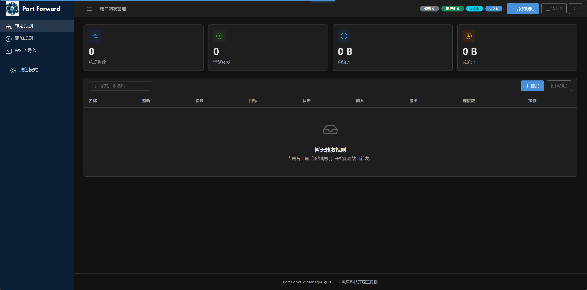
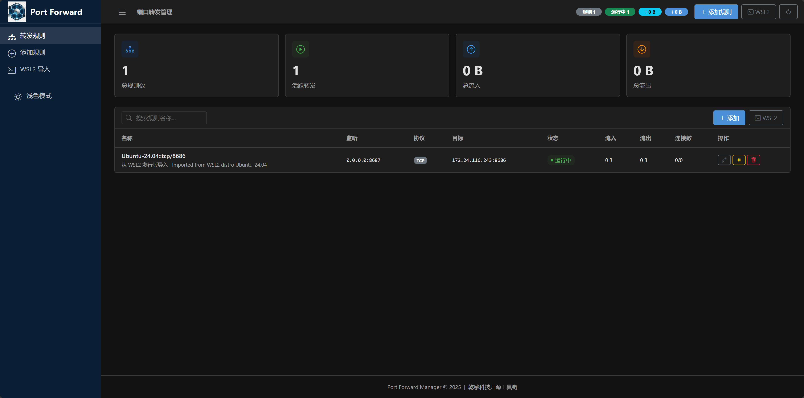
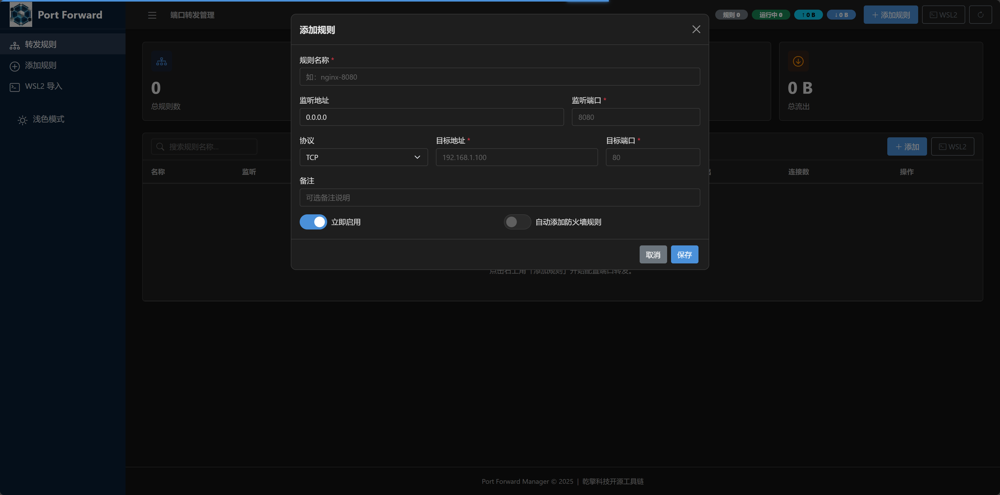
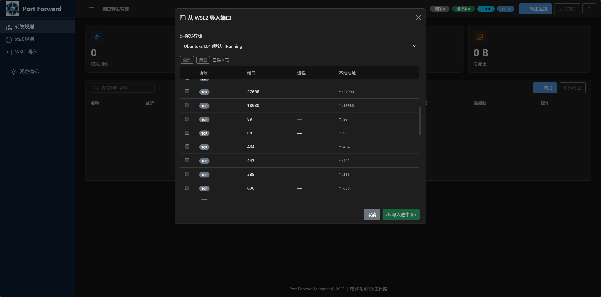
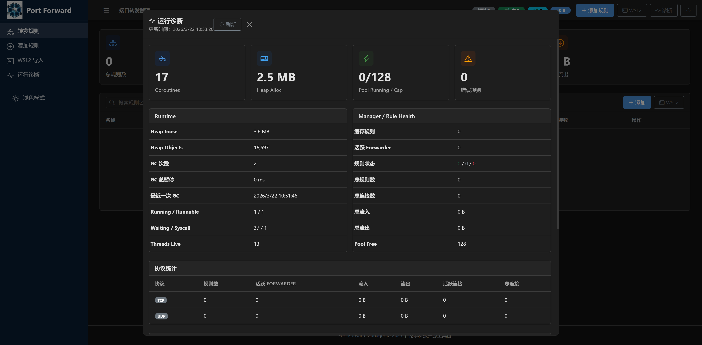

# Go Port Forward

高性能跨平台 TCP/UDP/Both 端口转发工具，内置 Web 管理界面。

A high-performance cross-platform TCP/UDP port forwarder with a built-in Web UI.

## 源码地址 | Source Code

| 平台           | 地址                                           |
|--------------|----------------------------------------------|
| 🌐 Github 主站 | https://github.com/shibingli/go-port-forward |
| 🪞 Gitee 镜像站 | https://gitee.com/shibingli/go-port-forward  |

## 下载 | Download

[点击下载](https://github.com/shibingli/go-port-forward/releases)

## 📸 截图 | Screenshots

### 首页 | Dashboard


### 转发列表 | Rule List


### 添加转发 | Add Rule


### WSL2 端口导入 | WSL2 Import


### 诊断工具 | Diagnostics


## ✨ 功能特性 | Features

- **TCP / UDP / Both** 端口转发，支持同时转发双协议
- **Web 管理界面** — 基于 Alpine.js + Bootstrap 5 的现代化单页应用
- **运行诊断面板** — 实时查看 runtime / goroutine pool / rule health / 热点规则，并支持一键定位异常规则
- **WSL2 端口导入** — 自动发现 WSL2 发行版监听端口并一键导入转发规则
- **跨平台防火墙管理** — Windows (netsh)、Linux (iptables)、macOS (pfctl) 自动添加/删除防火墙规则
- **系统服务支持** — 可注册为 Windows Service / Linux systemd / macOS launchd 后台服务
- **高性能并发** — 基于 [ants](https://github.com/panjf2000/ants) 协程池，支持高并发连接
- **嵌入式存储** — 使用 [bbolt](https://go.etcd.io/bbolt) 嵌入式 KV 数据库，零依赖部署
- **自动 GC 管理** — 内存阈值触发 + 定时 GC，多种回收策略可选
- **YAML 配置** — 首次运行自动生成默认配置文件

## 🎯 痛点分析 | Pain Points

| 痛点             | 传统方案                                                        | Go Port Forward 解决方式                    |
|----------------|-------------------------------------------------------------|-----------------------------------------|
| **WSL2 端口不可达** | 每次重启后手动执行 `netsh interface portproxy` 命令，IP 地址经常变化          | 自动发现 WSL2 发行版 IP 与监听端口，一键导入转发规则，重启后自动恢复 |
| **防火墙规则繁琐**    | 需要在 Windows/Linux/macOS 上分别记忆 netsh / iptables / pfctl 命令语法 | 跨平台统一 API，创建转发规则时自动添加防火墙放行，删除时自动清理      |
| **缺少可视化管理**    | SSH 隧道、socat、rinetd 等工具均为命令行操作，难以一目了然查看所有规则状态               | 内置 Web UI，实时查看规则状态、连接数与流量统计，支持增删改查与一键启停 |
| **进程退出规则丢失**   | iptables 转发规则或 socat 进程重启后消失，需手写 systemd 脚本保持持久化            | 基于 bbolt 嵌入式数据库持久化所有规则，服务启动时自动恢复所有活跃转发  |
| **高并发性能不足**    | socat 每连接 fork 进程，rinetd 单线程阻塞模型，面对大量连接时资源消耗大               | 基于 Go 协程 + ants 协程池，高并发连接下内存占用可控        |
| **部署依赖复杂**     | 需要安装 Python/Node.js 运行时或依赖外部数据库                             | 单个二进制文件零依赖部署，内嵌 Web 资源与 KV 存储，开箱即用      |
| **跨平台不统一**     | 不同工具在 Windows/Linux/macOS 上配置方式完全不同                         | 同一份代码与配置，三大平台行为一致，支持注册为系统服务             |

## 🏗️ 应用场景 | Use Cases

### 1. WSL2 开发环境端口暴露

在 Windows 上使用 WSL2 进行开发时，WSL2 内部的服务（如 Nginx、MySQL、Redis）默认无法被局域网其他设备访问。Go Port Forward 可自动发现 WSL2 中的监听端口并创建转发规则，让同事的手机或其他电脑直接访问你的开发环境。

### 2. 内网服务统一转发网关

在企业内网中，多台服务器上运行着不同端口的服务。通过在一台网关机器上部署 Go Port Forward，可将所有服务端口集中转发和管理，Web UI 提供清晰的规则总览与流量监控。

### 3. 容器 / 虚拟机端口映射

Docker 容器、VMware/VirtualBox 虚拟机的网络模式（NAT、Host-Only）经常导致端口不可达。使用 Go Port Forward 在宿主机上建立转发规则，无需修改容器或虚拟机网络配置即可对外提供服务。

### 4. 远程调试与测试

后端开发人员需要将本地运行的 API 服务暴露给前端/测试同事访问。通过 Go Port Forward 将 `127.0.0.1:3000` 转发到 `0.0.0.0:3000`，配合自动防火墙放行，一键完成端口对外开放。

### 5. UDP 游戏/音视频服务转发

游戏服务器、VoIP、视频流等场景需要 UDP 转发能力。Go Port Forward 同时支持 TCP 和 UDP 协议转发，并可选择 `both` 模式双协议同时转发，无需部署两套工具。

### 6. 轻量级生产环境端口网关

在不需要 Nginx/HAProxy 完整反向代理功能的场景下（如纯 TCP 数据库代理、IoT 设备通信网关），Go Port Forward 可作为轻量级的四层端口网关，单二进制部署、资源占用极低。

## 📦 项目结构 | Project Structure

```
go-port-forward/
├── main.go                  # 程序入口 | Entry point
├── config.yaml              # 配置文件 | Configuration
├── internal/
│   ├── config/              # 配置加载 (Viper) | Config loading
│   ├── firewall/            # 跨平台防火墙管理 | Cross-platform firewall
│   │   ├── firewall.go      # 接口定义 | Interface
│   │   ├── firewall_windows.go
│   │   ├── firewall_linux.go
│   │   └── firewall_darwin.go
│   ├── forward/             # 转发核心 | Forwarding core
│   │   ├── manager.go       # 规则生命周期管理 | Rule lifecycle
│   │   ├── tcp.go           # TCP 转发器 | TCP forwarder
│   │   └── udp.go           # UDP 转发器 | UDP forwarder
│   ├── logger/              # 日志初始化 | Logger init
│   ├── models/              # 数据模型 | Data models
│   ├── storage/             # bbolt 持久化 | bbolt persistence
│   ├── svc/                 # 系统服务封装 | System service wrapper
│   └── web/                 # Web 服务 + 嵌入式静态资源 | Web server + embedded static
│       ├── server.go
│       ├── handlers.go
│       ├── handlers_wsl.go
│       └── static/          # 前端资源 (Alpine.js, Bootstrap, HTMX)
├── pkg/
│   ├── gc/                  # GC 管理服务 | GC management
│   ├── pool/                # 协程池封装 (ants) | Goroutine pool
│   ├── retry/               # 重试机制 | Retry utilities
│   ├── logger/              # 全局日志桥接 | Global logger bridge
│   ├── serializer/          # JSON 序列化 (sonic/jsoniter) | JSON serialization
│   └── os/                  # OS 工具 (WSL 发现等) | OS utilities
└── data/
    └── rules.db             # bbolt 数据库文件 | Database file
```

## 🚀 快速开始 | Quick Start

### 编译 | Build

项目提供了跨平台构建脚本，支持一键编译所有平台（Windows / Linux / macOS，amd64 / arm64 / arm）并自动打包：

```bash
# Linux / macOS
bash build.sh              # 构建所有平台
bash build.sh windows      # 仅构建 Windows
bash build.sh linux        # 仅构建 Linux
bash build.sh darwin       # 仅构建 macOS
```

```powershell
# Windows (PowerShell)
.\build.ps1                # 构建所有平台
.\build.ps1 -Target windows   # 仅构建 Windows
.\build.ps1 -Target linux     # 仅构建 Linux
.\build.ps1 -Target darwin    # 仅构建 macOS
```

构建产物输出到 `dist/` 目录，包含可执行文件、配置示例和 SHA256 校验文件。

> 也可通过环境变量指定版本号：`VERSION=v1.0.0 bash build.sh`

### CI/CD 自动发布 | Automated Release

项目集成了 GitHub Actions，推送符合格式的 tag 后会自动触发全平台构建并创建 GitHub Release：

```bash
# 正式版本发布
git tag v1.0.0
git push origin v1.0.0

# 预发布版本（带后缀自动标记为 Pre-release）
git tag v1.0.0-beta.1
git push origin v1.0.0-beta.1
```

**触发规则：** tag 格式为 `v{主版本}.{次版本}.{修订号}` 或 `v{主版本}.{次版本}.{修订号}-{后缀}`。

**自动完成：** 7 个平台产物编译 → 打包归档 → 生成 SHA256 校验 → 创建 Release 并上传。

### 运行 | Run

```bash
# 前台运行 | Foreground
./go-port-forward

# 指定配置文件 | With custom config
./go-port-forward -config /path/to/config.yaml
```

启动后访问 `http://127.0.0.1:8080` 打开 Web 管理界面。

### 系统服务 | System Service

```bash
# 安装为系统服务 | Install as system service
./go-port-forward -service install

# 以服务方式运行 | Run as service
./go-port-forward -service run

# 卸载服务 | Uninstall service
./go-port-forward -service uninstall
```

## ⚙️ 配置 | Configuration

首次运行时会在可执行文件同目录自动生成 `config.yaml`：

```yaml
web:
  host: 127.0.0.1          # Web UI 监听地址
  port: 8080                # Web UI 端口
  # username: admin         # Basic Auth 用户名 (留空禁用)
  # password: secret        # Basic Auth 密码

storage:
  path: data/rules.db       # 数据库路径

log:
  level: info               # 日志级别: debug | info | warn | error
  path: logs/app.log        # 日志文件路径
  max_size_mb: 50           # 单文件最大 MB
  max_backups: 5            # 保留备份数
  max_age_days: 30          # 保留天数
  compress: true            # 压缩归档

forward:
  buffer_size: 32768        # I/O 缓冲区大小 (bytes)
  dial_timeout: 10          # 出站连接超时 (秒)
  udp_timeout: 30           # UDP 会话空闲超时 (秒)
  pool_size: 0              # 协程池大小 (0 = 自动)

gc:
  enabled: true
  interval_seconds: 300     # GC 间隔 (秒)
  strategy: standard        # GC 策略: standard | aggressive | conservative
  memory_threshold_mb: 100  # 内存阈值 (MB)
  enable_monitoring: true
```

## 🩺 运行诊断 | Diagnostics

Web UI 右上角或侧边栏提供 **「运行诊断」** 入口，用于快速排查转发规则、资源占用和运行状态问题。

### 面板内容

- **Runtime**：goroutines、heap alloc / inuse、GC 次数与暂停时间、线程数量
- **Goroutine Pool**：运行中协程数、空闲数、容量
- **Manager / Rule Health**：缓存规则数、活跃 forwarder 数、规则状态分布、总连接数与流量
- **协议统计**：分别展示 TCP / UDP 的规则数、活跃 forwarder、流量和连接数
- **热点规则**：按活跃连接 / 流量 / 总连接综合排序的 Top 规则
- **Top Active / Traffic / Error Rules**：分别按连接数、流量、错误次数拆分的榜单
- **错误规则摘要**：显示当前错误信息、错误次数、最近报错时间、最近状态变化时间

### 诊断交互能力

- **自动刷新**：诊断弹窗打开后会自动轮询刷新，关闭后停止刷新
- **手动刷新**：支持按钮即时拉取最新 diagnostics 数据
- **规则 drill-down**：点击热点规则或错误规则，可直接定位到规则表并打开对应规则编辑弹窗
- **仅定位模式**：启用后点击诊断规则项只滚动并高亮对应规则，不自动打开编辑弹窗
- **快照导出**：支持 **复制 JSON** 与 **下载 JSON**，方便排障留档或提交 issue

### diagnostics JSON 示例

实际返回值会随运行时状态变化，下面是一个精简示例：

```json
{
  "success": true,
  "data": {
    "timestamp": "2026-03-22T11:11:56+08:00",
    "runtime": { "goroutines": 12, "heap_alloc_bytes": 1766160 },
    "pool": { "running": 0, "free": 128, "cap": 128 },
    "manager": {
      "cached_rules": 2,
      "rule_health": { "active": 1, "inactive": 0, "error": 1 },
      "hot_rules": [
        { "id": "rule-1", "name": "api-tcp", "total_bytes": 1048576, "active_conns": 3 }
      ],
      "top_error_rules": [
        {
          "id": "rule-2",
          "name": "mysql-udp",
          "error": "dial tcp 127.0.0.1:3306: connectex: connection refused",
          "error_count": 4,
          "last_error_at": "2026-03-22T11:10:01+08:00",
          "last_status_change_at": "2026-03-22T11:10:01+08:00"
        }
      ],
      "errors": []
    }
  }
}
```

常用字段说明：

- `runtime`：Go 运行时与 GC 快照
- `pool`：goroutine pool 的运行状态
- `manager.hot_rules`：综合热点规则
- `manager.top_active_rules`：按活跃连接排序的规则榜单
- `manager.top_traffic_rules`：按总流量排序的规则榜单
- `manager.top_error_rules`：按错误次数排序的规则榜单
- `manager.errors`：当前处于错误状态的规则摘要

### 适用场景

- 规则显示异常但不确定是配置问题、端口占用还是运行时错误
- 想快速判断当前瓶颈在连接数、流量还是错误热点
- 需要导出一份运行快照给同事、测试或 issue 附件

## 🔌 REST API

| 方法       | 路径                        | 描述             |
|----------|---------------------------|----------------|
| `GET`    | `/api/rules`              | 列出所有转发规则       |
| `POST`   | `/api/rules`              | 创建转发规则         |
| `GET`    | `/api/rules/{id}`         | 获取单条规则         |
| `PUT`    | `/api/rules/{id}`         | 更新规则           |
| `DELETE` | `/api/rules/{id}`         | 删除规则           |
| `PUT`    | `/api/rules/{id}/toggle`  | 启用/禁用规则        |
| `GET`    | `/api/dashboard`          | 获取规则列表与聚合统计    |
| `GET`    | `/api/stats`              | 获取全局统计         |
| `GET`    | `/api/diagnostics`        | 获取运行诊断快照       |
| `GET`    | `/api/wsl/capability`     | 获取 WSL2 能力探测结果 |
| `GET`    | `/api/wsl/distros`        | 列出 WSL2 发行版    |
| `GET`    | `/api/wsl/ports/{distro}` | 列出发行版监听端口      |
| `POST`   | `/api/wsl/import`         | 批量导入 WSL2 端口   |

> 说明：WSL 相关接口仅在 Windows 上可用；在 Linux/macOS 上会返回 `501 Not Implemented`。

> 说明：`/api/diagnostics` 为只读诊断接口，适合接入前端面板、排障脚本或采样快照工具。

## 📋 系统要求 | Requirements

- **Go** 1.26+
- **Windows** / **Linux** / **macOS**
- 防火墙管理需要管理员/root 权限

## 📄 License

本项目基于 [Apache License 2.0](LICENSE) 许可证开源。

Licensed under the [Apache License, Version 2.0](http://www.apache.org/licenses/LICENSE-2.0).

